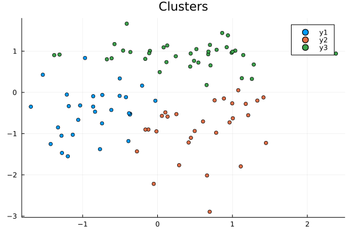

# HorseML


|GitHub Actions|Coveralls|CodeCov|Docs|
|:------------:|:-----:|:------:|:--------:|
|[![CI][CI-img]][CI-url] |[![Coverage Status][coveralls-img]][coveralls-url]|[![codecov][codecov-img]][codecov-url]|[![docs dev][docs-dev-img]][docs-dev-url] [![docs stable][docs-stable-img]][docs-stable-url]|

HorseML is machine learning library for JuliaLang. You can use various algorithms, from basic algorithms such as linear regression to neuralnetwork.

## Installation
From the Julia REPL, type ] to enter the Pkg REPL mode and run.
```@example
pkg> add HorseML
```

## Abstract
This library is ML library for JuliaLang. HorseML can be installed using the Julia package manager.　You can build many models, from simple models like regression to complex models like neural networks.Therefore, this package is recommended for beginners.

## Example
With HorseML, you can create the following models.

This model is a Decision Tree, you can make the model visualized like this:


This model is a polynomial Regression:


THis is a Clustering result:




[CI-img]: https://github.com/MommaWatasu/HorseML.jl/actions/workflows/CI.yml/badge.svg
[CI-url]: https://github.com/MommaWatasu/HorseML.jl/actions/workflows/CI.yml

[coveralls-img]: https://coveralls.io/repos/github/MommaWatasu/HorseML.jl/badge.svg?branch=master
[coveralls-url]: https://coveralls.io/github/MommaWatasu/HorseML.jl?branch=master

[codecov-img]: https://codecov.io/gh/MommaWatasu/HorseML.jl/branch/master/graph/badge.svg?token=LA9W61IWmW
[codecov-url]: https://codecov.io/gh/MommaWatasu/HorseML.jl

[docs-dev-img]: https://img.shields.io/badge/docs-dev-blue.svg
[docs-dev-url]: https://mommawatasu.github.io/HorseML.jl/dev

[docs-stable-img]: https://img.shields.io/badge/docs-stable-blue.svg
[docs-stable-url]: https://mommawatasu.github.io/HorseML.jl/stable