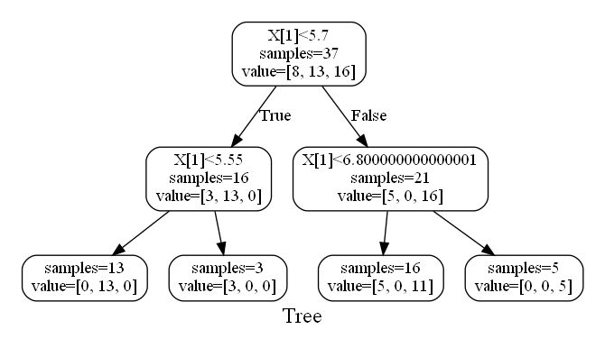

# Classification

## Models

```@docs
Classification.Logistic
Classification.SVC
```

# DecisionTree

## Models

```@docs
Tree.DecisionTree
Tree.RandomForest
```

## VisualTool
```@docs
Tree.MV
```

If you make the model created in DecisionTree Example visualized, it'll be like this:
