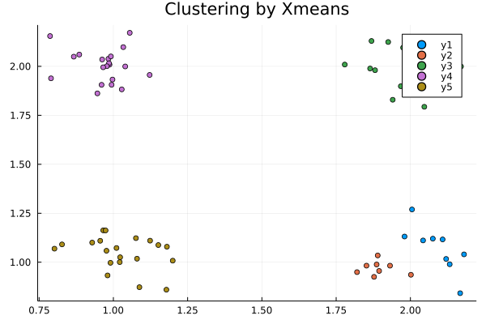
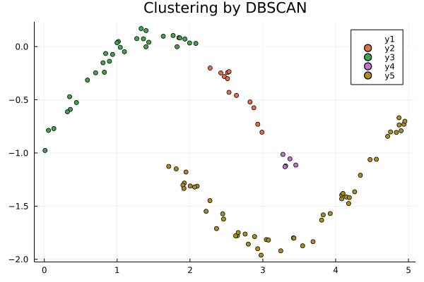

# Clustering

## data processing
In clustering, if data is randomly generated, it will not converge, so use data that has already been confirmed to converge.
Get the test data with the following command:
```
$ wget https://github.com/MommaWatasu/HorseML.jl/raw/master/test/clustering.csv
```
Once you get it, let's load it with Julia.
```
using CSV
using DataFrames

df = CSV.read("clustering.csv", DataFrame, header=false)
x = Array(df)
```

## Kmeans method
First, let's perform clustering using the Kmeans method.
```
using CSV
using DataFrames
using HorseML.Clustering
using HorseML.Clustering: fit!

#Download this file from https://raw.githubusercontent.com/MommaWatasu/HorseML.jl/master/test/clustering.csv
x = CSV.read("clustering.csv", DataFrame, header = false) |> Matrix

model = Kmeans(3)
fit!(model, x) # fitting
t = model.labels
```
Let's visualize the results.
```
using Plots

c1 = x[findall(t[:, 1].==1), :]
c2 = x[findall(t[:, 2].==1), :]
c3 = x[findall(t[:, 3].==1), :]

plot(c1[:, 1], c1[:, 2], seriestype = :scatter, title = "Clusters")
plot!(c2[:, 1], c2[:, 2], seriestype = :scatter)
plot!(c3[:, 1], c3[:, 2], seriestype = :scatter)
```

To find the error, you need to use a different function than regression.
```
using HorseML.LossFunction

dm(x, model(x), model.μ)
```
The distortion measure should be used in this way as an exception.

## GMM(Gaussian Mixture Model)
If the cluster follows a Gaussian distribution, this technique is effective.
```
model = GMM(3)
fit!(model, x) # fitting
model(x) # predicting
```
The Gaussian Mixture Model also needs to use a different loss function.
```
π, μ, Σ = model.π, model.μ, model.σ
nlh(x, π, μ, Σ)
```

## Xmeans
You sometime want to cluster without the number of clusters. The Xmeans method makes it possible using Kmeans and BIC.
```
#Download this file from https://raw.githubusercontent.com/MommaWatasu/HorseML.jl/master/test/clustering3.csv
x = CSV.read("clustering3.csv", DataFrame, header = false) |> Matrix

model = Xmenas()
fit!(model, x)
```
Let's visualize this as well
```
using Plots

plot(title="Clustering by Xmeans")
for i in 1 : maximum(model.labels)
    c = findall(model.labels.==i)
    plot!(data[c, 1], data[c, 2], st=:scatter)
end
plot!()
```


## DBSCAN
Now let's deal with density-based clustering techniques. This is useful when the shape of the cluster is special.
Instead of the number of clusters, DBSCAN requires the number of neighborhoods needed to grow the cluster and the maximum distance to the neighborhood.
```
#Download this file from https://raw.githubusercontent.com/MommaWatasu/HorseML.jl/master/test/clustering2.csv
x = CSV.read("clustering2.csv", DataFrame) |> Matrix
model = DBSCAN(0.3, 3)
result = model(x)
```
then, see the result
```
plot(title = "Clustering by DBSCAN")
for i in -1 : maximum(result)
    X = data[findall(result.==i), :]
    plot!(X[:, 1], X[:, 2], st=:scatter)
end
plot!()
```


## HDBSCAN
Finally, we do hierarchical density clustering. This algorithm is complicated, so I won't explain it here (see [`HDBSCAN`](@ref)).
I will only show you how to use it.
```
model = HDBSCAN(5, 3)
fit!(model, x) #This data is the same to previous section
```
Let's see the result
```
plot(title = "Clustering by HDBSCAN")
result = model.labels
for i in -1 : maximum(result)
    X = data[findall(result.==i), :]
    plot!(X[:, 1], X[:, 2], st=:scatter)
end
plot!()
```

Oh? The light blue dots are mixed, did you fail? No, this is the point that was dropped from the cluster as noise. The feature of HDBSCAN is that the cluster is not easily affected even if there is noise.